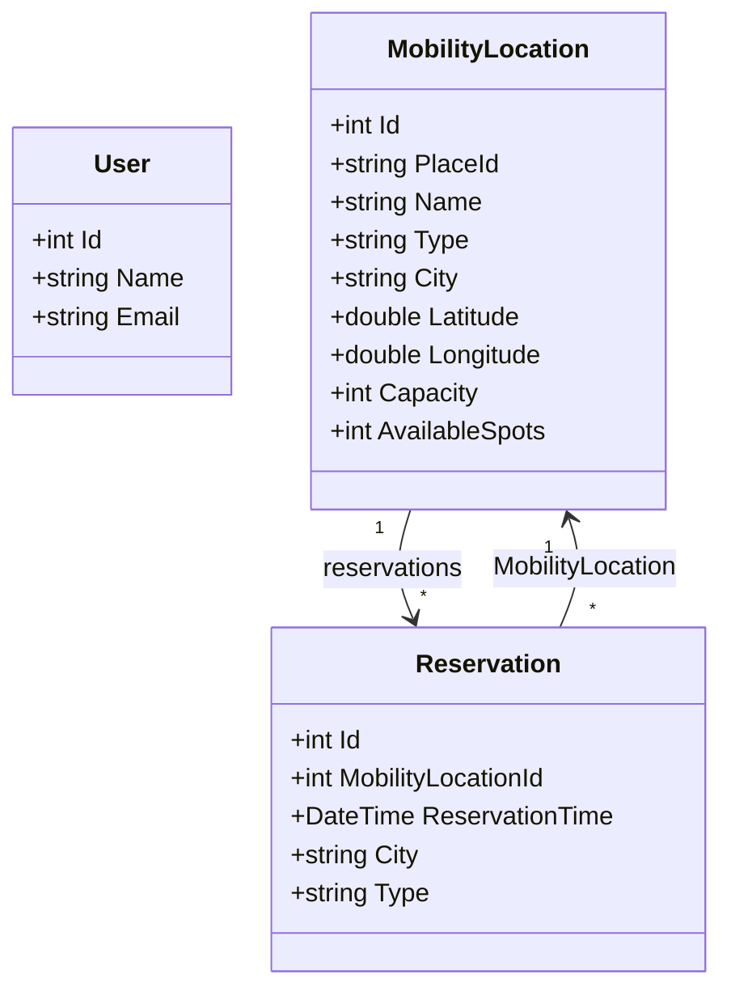
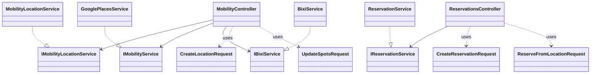

# SUMMS class diagram (current codebase)

This document reflects the **implemented** persistence model and optional API/service layers. It is the export requested for tooling (Mermaid renders in GitHub, VS Code, and many Markdown viewers).

---

## 1. Persisted entities (EF Core)

Source of truth: [`Data/AppDbContext.cs`](../Data/AppDbContext.cs), model classes in [`Domain/Models/`](../Domain/Models) and [`Models/User.cs`](../Models/User.cs).

### Attributes

| Class | Attributes |
|-------|------------|
| **User** | `Id`, `Name`, `Email` |
| **MobilityLocation** | `Id`, `PlaceId`, `Name`, `Type`, `City`, `Latitude`, `Longitude`, `Capacity`, `AvailableSpots` |
| **Reservation** | `Id`, `MobilityLocationId`, `ReservationTime`, `City`, `Type` |

### Foreign key and multiplicity

- **Reservation → MobilityLocation:** `MobilityLocationId` is a required FK to `MobilityLocation.Id`.
- **Multiplicity:** one `MobilityLocation` to many `Reservation` (`1` : `*`).
- **Cascade:** deleting a `MobilityLocation` cascades to its `Reservation` rows (see EF migrations).

**User** is registered in `AppDbContext` but has **no** navigation properties or foreign keys to `Reservation` or `MobilityLocation`.

---

## 2. Domain class diagram (Mermaid)

---

## 3. Scope for submissions (rubric alignment)

| If your rubric asks for… | Use this document |
|--------------------------|-----------------|
| **Database / domain model only** | Sections 1–2 above (three classes, one association). |
| **API and layering** | Section 4 below adds controllers, application services, and request DTOs (no extra DB tables). |
| **External data sources** | Section 5 notes BIXI GBFS and Google Places; they **materialize** `MobilityLocation` in memory; BIXI rows are not persisted unless saved via the mobility API. |

You still need to **match the wording of your course hand-in**; this file gives both a minimal and an expanded view so you can pick one without redrawing from scratch.

---

## 4. Application layer (optional diagram)

Controllers depend on services; services use `AppDbContext` or `HttpClient`. Request bodies are separate DTO classes (not subclasses of domain entities).

---

## 5. Gap vs. earlier domain model (reference diagram)

The earlier conceptual model included a central **City** entity, **Trip**, **ScooterPool**, **ParkingFacility**, **BixiStation** / **BixiStationStatus**, **MobilityEvent**, **MetricSnapshot**, **Admin**, and **User** linked to reservations and trips.

**Current code differs as follows:**

| Reference concept | Current implementation |
|-------------------|------------------------|
| `City` as entity | `City` is a **string** on `MobilityLocation` and `Reservation`. |
| `ParkingFacility` / pools | Unified as **`MobilityLocation`** with `Type` (e.g. `bixi`, `parking`). |
| `BixiStation` / status rows | BIXI feed maps to **`MobilityLocation`** in memory; no separate status entity in the DB. |
| `Trip` | Not modeled as a persisted entity. |
| `User` ↔ `Reservation` | **No `UserId`** on `Reservation`; `User` is not associated in EF. |
| `Admin`, `MetricSnapshot`, `MobilityEvent` | Not present in `DbContext` or domain models. |

If the assignment requires the **target** domain rather than **as-built** code, keep this list as a short appendix next to your diagram.

---

## 6. Frontend (optional)

The Angular app defines a **`MobilityLocation`** interface in [`frontend/summs-ui/src/app/map/mobility.service.ts`](../frontend/summs-ui/src/app/map/mobility.service.ts) for API JSON (`placeId`, `name`, `type`, coordinates). It is a **client-side view model**, not the EF entity, but aligns with API payloads for map features.
